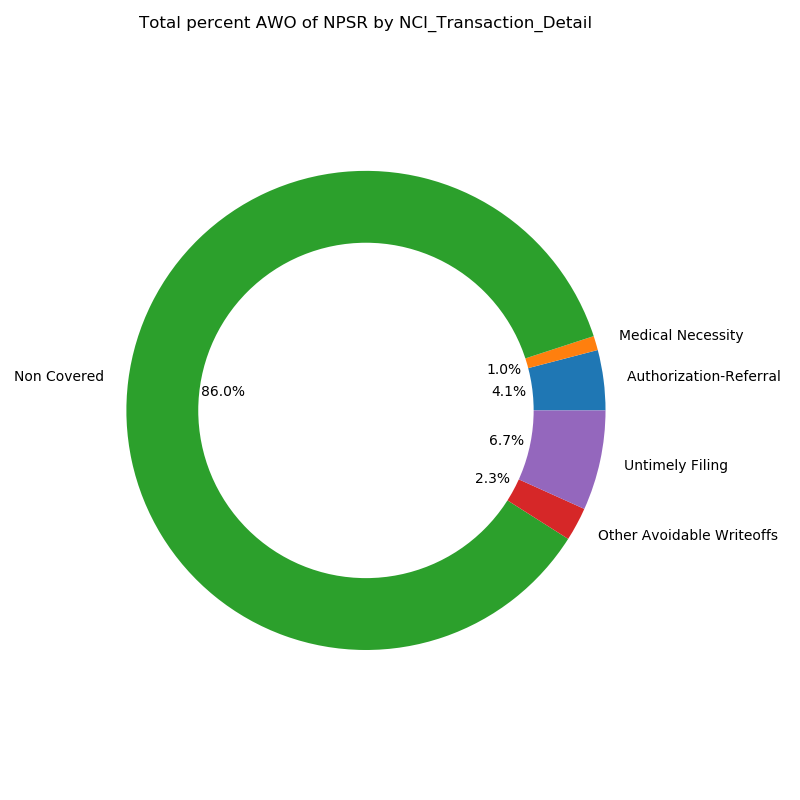
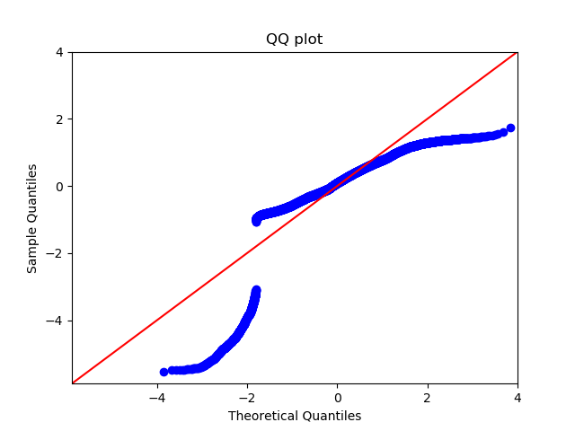

# Analyzing Healthcare Data

We obtained heath care data of patients, whose names and information has been made private.  The information provided in the data includes the following categories:

* account_id - patients account identifier
* LocationID - six unique values (Hospital 1, 2, 3, 4, 5, 6)
* Service_Code - seven unique values (Outpatient, Emergency, Observation, Dialysis, Psych, Rehab, Inpatient)
* Transaction_Number
* TransactionType_Tdata - all 'Adjustment'
* Service_Date
* Post_Date
* Account_Discharge_Date
* Procedure_Code - 515 unique values
* Procedure_Description - 30 unique values
* Transaction_Amount - avoidable write-off amount
* AWO $ Bucket - six unique values (1. <0, 2. 0-1000, 3. 1000-2500, 4. 2500-5000, 5. 5000-10000, 6.10000+)
* Insurance_Code - 141 unique values
* Insurance_Code_Description - 15 unique values
* Financial_Class - three unique values (Government, Commercial, Other)
* NCI_Transaction_Category - all 'Adjustment'
* NCI_Transaction_Type - all 'Avoidable Write-offs'
* NCI_Transaction_Detail - five unique values (Non-Covered, Authorization-Referral, Untimely Filing, Medical Necessity, Other Avoidable Write-offs)
* Account_Balance
* Account_Billed_Date
* Admit_Date
* Admit_Diagnosis - 5310 unique values, ~15% null
* Admit_Type - five unique values (Elective, Emergency, Other, Urgent, Triage)
* Billing_Status - five unique value (Final Bill, Bad Debt, Other, Un-billed, In-house)
* Current_Patient_Class_Description - seven unique values (Office visit, Outpatient, Emergent, Observation, Same Day Surgery, Recurring, Inpatient)
* Discharge_Department_ID - 28 unique values
* First_Claim_Date
* Last_Claim_Date
* Last_Payment_Amount
* Last_Payment_Date
* Length_Of_Stay
* Medicaid_Pending_Flag - Yes or No
* Medical_Record_Number
* Patient_Insurance_Balance
* Patient_Self_Pay_Balance
* Primary_Diagnosis - 5033 unique values
* Primary_Service_Name - 29 unique values
* ICD-10_Diagnosis_Principal - 5310 unique values
* ICD-10_Diagnosis - 5310 unique values
* Region - three unique values (Central, East, West)
* NPSR - Net Patient Service Revenue

From this information, we looked at avoidable write-off transaction amounts by the following:
* Insurance
* Transaction Detail
* Hospital
* Patient Class
* Department
* Date
* Service Type

We want to look at avoidable write-off (AWO) transaction amount as a percentage of NPSR.  We want to compare that percentage to an industry average of:
* 0.74% - Top Quartile Performance
* 1.54% - National Average Performance
If we see a gap between actual hospital performance and the national average, we see a potential financial opportunity.  We want to decrease the AWO/NPSR percentage.  If we can decrease the AWO transaction amount, we can save money.

To get an idea of the data we are dealing with, its easiest to visualize the data.

# Exploratory Data Analysis and Data Visualization

We looked at all hospitals grouped together, and also looked at all six hospitals individually.  We created algorithms that can quickly group each hospital (or all hospitals grouped together) by specified categories, such as:
* Insurance_Code_Description
* NCI_Transaction_Detail
* Discharge_Department_ID
* Service_Code
* or any other column in the data frame

And from that grouped information, we can compare variables within that category.  All of the information is looking at AWOs as a percentage of NPSR.

#### When we group hospitals by specific categories, we can break down the variables within those categories in order to determine what variables result in higher percentages of AWOs as NPSR.  Just some of the breakdowns are presented below.

## All Hospitals

### By Service Code: Total (Service_Code)
When grouping all hospitals by Service Code, and looking at all variables, 'Outpatient', 'Emergency', 'Rehab', and 'Observation' account for the majority of AWO percentage.

### By Transaction Detail: Total (NCI_Transaction_Detail)
When grouping all hospitals by Transaction Detail, and looking at all variables, 'Non Covered' accounts for more than 85% of the AWO percentage.

### By Transaction Detail: Emergency
When grouping all hospitals by Transaction Detail, and just looking at the 'Emergency' variable of Transaction Detail, 'Non Covered' accounts for more than 95% of the AWO percentage.

### By Transaction Detail: Rehab
When grouping all hospitals by Transaction Detail, and just looking at the 'Rehab' variable of Transaction Detail, 'Non Covered' accounts for only 65% of the AWO percentage.  This is significant in comparison to 95% for 'Emergency'.

### By Insurance (Insurance_Code_Description)
When grouping all hospitals by Insurance Code, the 'Commercial 3' Insurance Code is associated with a higher AWO percentage.

<!-- ### By Transaction Detail (NCI_Transaction_Detail)

### By Hospital (LocationID)

### By Department (Discharge_Department_ID)

### By Patient Class (Service_Code)
 -->

## Hospital 1

<!-- ### H1 - By Insurance (Insurance_Code_Description)
 -->

### H1 - By Transaction Detail
When grouping Hospital 1 by Transaction Detail, the 'Authorized Referral' Transaction Detail is associated with a lower AWO percentage.  

<!-- ### H1 - By Department (Discharge_Department_ID)
 -->

<!-- ### H1 - By Patient Class (Service_Code)
 -->

<!-- ## Hospital 2

### H2 - By Insurance (Insurance_Code_Description)

### H2 - By Transaction Detail (NCI_Transaction_Detail)

### H2 - By Department (Discharge_Department_ID)

### H2 - By Patient Class (Service_Code)
 -->

<!-- ## Hospital 3 -->

<!-- ### H3 - By Insurance (Insurance_Code_Description)

### H3 - By Transaction Detail (NCI_Transaction_Detail)

### H3 - By Department (Discharge_Department_ID)
 -->

<!-- ### H3 - By Patient Class (Service_Code)
 -->

## Hospital 4

### H4 - By Insurance
When grouping Hospital 4 by Insurance Code, the 'Commercial 3' and 'Commercial 6' Insurance Codes are associated with higher AWO percentages.

<!-- ### H4 - By Transaction Detail (NCI_Transaction_Detail)

### H4 - By Department (Discharge_Department_ID)

### H4 - By Patient Class (Service_Code)
 -->

<!-- ## Hospital 5 -->

<!-- ### H5 - By Insurance (Insurance_Code_Description)

### H5 - By Transaction Detail (NCI_Transaction_Detail)
 -->

<!-- ### H5 - By Department (Discharge_Department_ID)
 -->

<!-- ### H5 - By Patient Class (Service_Code)
 -->

<!-- ## Hospital 6

### H6 - By Insurance (Insurance_Code_Description)
 -->

<!-- ### H6 - By Transaction Detail (NCI_Transaction_Detail)

### H6 - By Department (Discharge_Department_ID)

### H6 - By Patient Class (Service_Code)
 -->

#### These are just a handful of the visualizations that can be quickly customized based on the categories and variables we want to look at.  

# Regression Models

Since the independent variables of the data we are looking at are mostly non-numeric (categorical), we were able to create dummy variables of the categorical data.  This way, we can represent the categorical data as numbers. For the regression models, we created a dataframe of all dummied variables, with exception to the target, which was AWO %.

We explored co-linearity by checking the features variance inflation factors (VIFs).  After eliminating features showing co-linearity, we ended up with 39 features.

To ensure a representative linear model, the residuals have to be normally distributed, and display homoscedasticity.

This QQ plot shows the distribution of the residuals is not normally distributed.

This scatterplot of the residuals exemplifies heteroscedasticity.

Based on these characteristics of the residuals, all of the assumptions associated with linear regression are not met.  Because of this, we decided to move onto non-parametric learners.

# XGBoost Binary Classification
One of our goals was to predict if the AWO transaction amount was going to be (A) in the first two buckets (between $0 and $1,000), or (B) in the remaining four buckets (above $1,000).  The features we used to predict this were:

* Service Code
* Transaction Detail
* Class Description
* Discharge Department
* Service Name

In order for our model to predict correctly, let's check to see the balance of our classes.

Since there are many more cases of (A) than (B), we used SMOTE to balance our data.

Now, we can model more appropriately.

Below is a confusion matrix of our results:

Interpreting the matrix:
* **Top left box** - Just using the five features mentioned above to represent a patient, our model will predict correctly 90% if the AWO amount associated with that patient will be under $1,000.
* **Top right box** - 10% of the time, our model will predict that patients' AWO amount will be over $1,000, when it is actually below $1,000.
* **Bottom right box** - Just using the five features mentioned above to represent a patient, our model will predict correctly 70% if the AWO amount associated with that patient will be above $1,000.
* **Bottom left box** - 30% of the time, our model will predict that patients' AWO amount will be under $1,000, when it is actually above $1,000.
